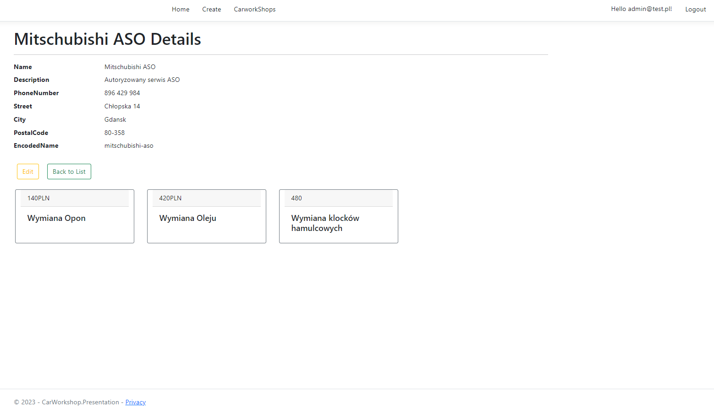

# CarWorkshopBase.MVC
1. [Introduction](#introduction)
2. [Requires](#introduction)
3. [How to run the program](#how-to-run-the-program)
5. [Short project overview](#Short-project-overview)

# Introduction
The WorkshopMVC application in ASP.NET Core allows users to register, add car repair shops and their services, providing a simple interface for managing and viewing information related to the workshops and services offered.
Only registered users can create new workshops, while editing existing ones can only be done by their creators or system administrators.
This is a hobbyist project carried out to explore the MVC framework in the context of developing an application to support the automotive industry.
WorkshopMVC is a database application using Clean Architecture and the CQRS pattern.
The project uses a number of tools and technologies, such as .NET, Entity Framework, Mediatr, AutoMapper, MSSQL, jQuery, Bootstrap and HTML.
## Requires

- .NET Core framework
- Visual Studio or VS Code
- MSSQL Server Database (or Azure Data Studio)
# How to run the program
1. You should have .NET 7.0 installed.
2. Open `CarWorkshop.MVC\CarWorkshop.MVC.sln` and open secrets.json by right-click mouse on presentation layer and choose "Manage user Secrets" then replace the connection string with connection string to your databse.
3. In Visual Studio:
	- Open the solution in Visual Studio
	- Open "Package manager console" and select the project "CarWorkshop.Presentation"
	- Enter the command "Update-Database"

	

# Short project overview

The application seeds the first workshop named mithubishi aso and creates a user with Admin rights
 
